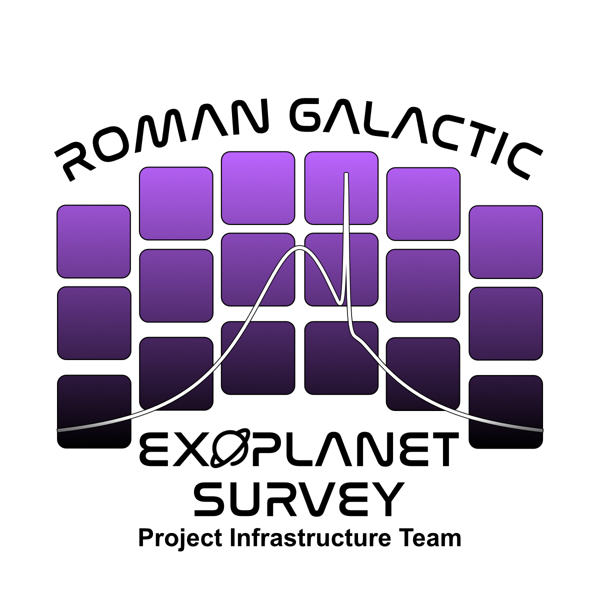

<div align="center">
  <a href="https://github.com/AmberLee2427/microlens-submit">
    
  </a>
</div>

# <font face="Helvetica" size="7"> Contributing to the Microlensing Analysis Tutorial </font>

<hr style="border: 1.5pt solid #a859e4; width: 100%; margin-top: -10px;">

Thank you for your interest in contributing to the microlensing analysis tutorial! This document provides guidelines for adding new tool sections, improving existing content, and maintaining the quality of the tutorial.

## <font face="Helvetica" size="6"> Overview </font>

<hr style="border: 1.5pt solid #a859e4; width: 100%; margin-top: -10px;">

The microlensing analysis tutorial (`analysis_tutorial_colab.txt`) is designed to showcase various open-source microlensing tools and provide working examples for the community. Our goal is to create a comprehensive resource that helps users understand and implement different microlensing analysis techniques.

## <font face="Helvetica" size="6"> How to Contribute </font>

<hr style="border: 1.5pt solid #a859e4; width: 100%; margin-top: -10px;">

### <font face="Helvetica" size="5"> 1. Adding a New Tool Section </font>

If you'd like to add a section for a new microlensing tool, follow these steps:

#### <font face="Helvetica" size="4"> Step 1: Check the Tool Table </font>

First, check the tool table in the tutorial to see if your tool is already listed. If it's marked as "No" in the "Covered here" column, you can add a section for it.

#### <font face="Helvetica" size="4"> Step 2: Create Your Section </font>

Use the following template structure for your tool section:

```markdown
## <font face="Helvetica" size="6"> X. Tool Name </font>

<hr style="border: 1.5pt solid #a859e4; width: 100%; margin-top: -10px;">

Brief introduction to the tool, its capabilities, and when to use it.

### <font face="Helvetica" size="5"> X.1 Installation and Setup </font>

```python
#@title Installation
# Installation commands and setup instructions
!pip install tool-name
# or
!conda install -c conda-forge tool-name
```

### <font face="Helvetica" size="5"> X.2 Basic Usage </font>

```python
#@title Import and Basic Setup
import tool_name
# Basic setup code
```

### <font face="Helvetica" size="5"> X.3 Model Examples </font>

#### <font face="Helvetica" size="4"> X.3.1 Single Lens Example </font>

```python
#@title Single Lens Model
# Complete working example for single lens fitting
```

#### <font face="Helvetica" size="4"> X.3.2 Binary Lens Example </font>

```python
#@title Binary Lens Model
# Complete working example for binary lens fitting
```

### <font face="Helvetica" size="5"> X.4 Advanced Features </font>

```python
#@title Advanced Features
# Examples of parallax, finite source effects, etc.
```

### <font face="Helvetica" size="5"> X.5 Performance and Best Practices </font>

Discussion of performance considerations, best practices, and tips for efficient usage.
```

#### <font face="Helvetica" size="4"> Step 3: Include Required Elements </font>

Every tool section should include:

1. **Installation instructions** - How to install the tool
2. **Basic usage** - Simple examples to get started
3. **Model examples** - At least one working example
4. **Data handling** - How to load and process data
5. **Fitting examples** - Complete fitting workflows
6. **Results visualization** - How to plot and analyze results
7. **Performance notes** - Computational considerations
8. **Best practices** - Tips for effective usage

### <font face="Helvetica" size="5"> 2. Improving Existing Sections </font>

If you'd like to improve an existing section:

1. **Add more examples** - Different model types or parameter combinations
2. **Improve documentation** - Better explanations or more detailed comments
3. **Add performance tips** - Optimization strategies or computational advice
4. **Fix issues** - Correct errors or update outdated information
5. **Add visualizations** - Better plots or additional analysis tools

### <font face="Helvetica" size="5"> 3. Code Quality Standards </font>

#### <font face="Helvetica" size="4"> Python Code Style </font>

- Follow PEP 8 guidelines
- Use descriptive variable names
- Add comprehensive comments
- Include docstrings for functions
- Handle errors gracefully

#### <font face="Helvetica" size="4"> Example Code Requirements </font>

- **Working examples** - All code should run without errors
- **Complete workflows** - From data loading to results
- **Clear output** - Include expected results and plots
- **Educational value** - Explain what each step does
- **Realistic data** - Use appropriate test data or synthetic data

#### <font face="Helvetica" size="4"> Jupyter Notebook Format </font>

- Use `#@title` for cell titles
- Include markdown explanations
- Use consistent formatting
- Add proper metadata for cells

### <font face="Helvetica" size="5"> 4. Content Guidelines </font>

#### <font face="Helvetica" size="4"> Educational Focus </font>

- **Explain the science** - Don't just show code, explain why
- **Include theory** - Brief explanations of the underlying physics
- **Show limitations** - Discuss when the tool might not work
- **Provide context** - When to use this tool vs. others

#### <font face="Helvetica" size="4"> Practical Examples </font>

- **Use realistic data** - Synthetic data that mimics real observations
- **Show complete workflows** - From start to finish
- **Include error handling** - What to do when things go wrong
- **Demonstrate best practices** - Efficient and robust approaches

#### <font face="Helvetica" size="4"> Documentation Standards </font>

- **Clear explanations** - Assume the reader is new to the tool
- **Consistent terminology** - Use standard microlensing terms
- **Cross-references** - Link to relevant literature or other sections
- **Troubleshooting** - Common issues and solutions

### <font face="Helvetica" size="5"> 5. Testing Your Contributions </font>

Before submitting your contribution:

1. **Test the code** - Ensure all examples run without errors
2. **Check formatting** - Verify the notebook renders correctly
3. **Validate results** - Make sure the output makes sense
4. **Test with different data** - Ensure robustness
5. **Get feedback** - Ask others to review your contribution

### <font face="Helvetica" size="5"> 6. Submission Process </font>

1. **Fork the repository** - Create your own copy
2. **Create a branch** - Use a descriptive branch name
3. **Make your changes** - Follow the guidelines above
4. **Test thoroughly** - Ensure everything works
5. **Submit a pull request** - Include a clear description

### <font face="Helvetica" size="5"> 7. Pull Request Guidelines </font>

When submitting a pull request:

#### <font face="Helvetica" size="4"> Required Information </font>

- **Clear title** - Describe what you're adding/improving
- **Detailed description** - Explain the changes and motivation
- **Testing notes** - What you tested and how
- **Screenshots** - If adding visualizations

#### <font face="Helvetica" size="4"> Example Pull Request Description </font>

```
## Add VBMicrolensing Section

This PR adds a comprehensive section for VBMicrolensing, including:

- Installation and setup instructions
- Basic single lens examples
- Binary lens fitting with caustics
- Parallax and finite source effects
- Performance optimization tips

### Testing
- Tested all examples with synthetic data
- Verified installation on Colab and local environments
- Compared results with known parameters
- Added error handling for common issues

### Files Changed
- docs/analysis_tutorial_colab.txt: Added VBMicrolensing section
- Updated tool table to mark VBMicrolensing as covered

Closes #123
```

### <font face="Helvetica" size="5"> 8. Tool-Specific Guidelines </font>

#### <font face="Helvetica" size="4"> For Each Tool, Consider: </font>

**Installation Complexity**
- How easy is it to install?
- Are there dependencies or system requirements?
- Does it work on different platforms?

**Learning Curve**
- How intuitive is the API?
- What background knowledge is required?
- Are there good documentation resources?

**Performance Characteristics**
- How fast is it for different model types?
- What are the memory requirements?
- Are there optimization options?

**Integration**
- How well does it work with other tools?
- Can it export results in standard formats?
- Is it compatible with common data formats?

### <font face="Helvetica" size="5"> 9. Maintenance and Updates </font>

#### <font face="Helvetica" size="4"> Keeping Content Current </font>

- **Regular updates** - Check for new tool versions
- **API changes** - Update examples when tools change
- **Performance improvements** - Incorporate new features
- **Bug fixes** - Correct issues as they're discovered

#### <font face="Helvetica" size="4"> Version Compatibility </font>

- **Test with latest versions** - Ensure examples work with current releases
- **Note version requirements** - Specify minimum versions
- **Handle deprecations** - Update code when features are deprecated
- **Backward compatibility** - Consider older versions when possible

### <font face="Helvetica" size="5"> 10. Community Guidelines </font>

#### <font face="Helvetica" size="4"> Be Respectful </font>

- **Constructive feedback** - Focus on improving the content
- **Acknowledge contributions** - Credit others for their work
- **Help newcomers** - Be patient with those learning

#### <font face="Helvetica" size="4"> Share Knowledge </font>

- **Document your process** - Help others learn from your experience
- **Share best practices** - Contribute tips and tricks
- **Report issues** - Help identify and fix problems

#### <font face="Helvetica" size="4"> Stay Engaged </font>

- **Respond to feedback** - Address comments and suggestions
- **Update regularly** - Keep your contributions current
- **Help maintain** - Assist with ongoing maintenance

## <font face="Helvetica" size="6"> Getting Help </font>

<hr style="border: 1.5pt solid #a859e4; width: 100%; margin-top: -10px;">

If you need help with your contribution:

1. **Check existing issues** - See if your question has been answered
2. **Review documentation** - Look at existing sections for examples
3. **Ask in discussions** - Use GitHub Discussions for questions
4. **Contact maintainers** - Reach out directly if needed

## <font face="Helvetica" size="6"> Recognition </font>

<hr style="border: 1.5pt solid #a859e4; width: 100%; margin-top: -10px;">

Contributors will be recognized in several ways:

- **Author credits** - Listed in the tutorial header
- **GitHub contributors** - Visible in the repository
- **Documentation** - Acknowledged in relevant sections
- **Community** - Recognition in the microlensing community

## <font face="Helvetica" size="6"> Code of Conduct </font>

<hr style="border: 1.5pt solid #a859e4; width: 100%; margin-top: -10px;">

This project follows the [Contributor Covenant Code of Conduct](https://www.contributor-covenant.org/version/2/0/code_of_conduct/). Please be respectful and inclusive in all interactions.

## <font face="Helvetica" size="6"> License </font>

<hr style="border: 1.5pt solid #a859e4; width: 100%; margin-top: -10px;">

By contributing to this tutorial, you agree that your contributions will be licensed under the same license as the project.

---

Thank you for contributing to the microlensing community! Your efforts help make microlensing analysis more accessible and effective for everyone.
